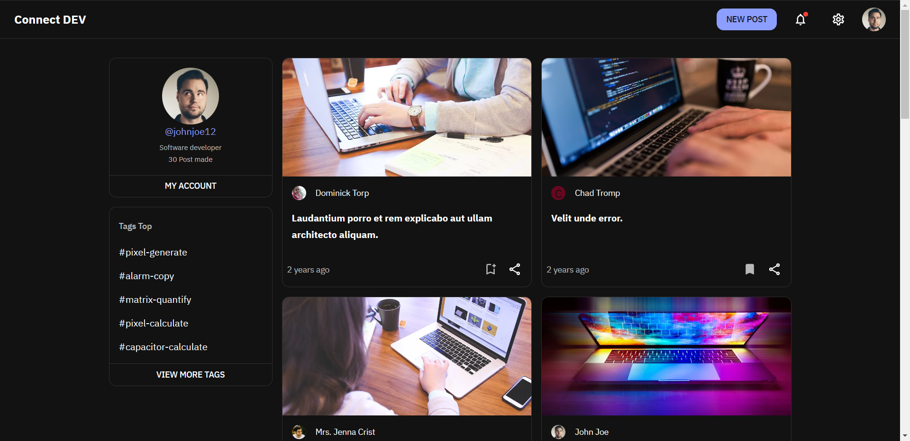

# React Template Blog Dev

I have created a blog template specifically designed for developers using the React framework and the Material-UI component library. 

  

  
 

  <a href="https://react-template-blog-dev.vercel.app/"> View Demo </a>

# Description

I have created a blog template specifically designed for developers using the React framework and the Material-UI component library. This template is built to provide a modern and visually appealing design that conforms to Material Design standards. This means that users will be able to create a blog that has a polished and professional look and feel.

The template is also optimized for performance, allowing users to easily add new content and customize the layout to suit their needs. This means that users will be able to quickly and easily create a blog that is tailored to their specific requirements. Additionally, the template is fully responsive, so it will look great on any device, whether it's a desktop, laptop, tablet, or mobile phone.

In summary, my blog template for developers using React and Material-UI is a great choice for anyone who wants to create a beautiful, functional and professional blog that is easy to customize and maintain.

## Theme Dark/Light

Yes, my blog template for developers using React and Material-UI includes a dark or light theme option in the menu. This allows users to easily switch between themes based on their personal preferences and also depending on lighting conditions. Additionally, this theme option can also be beneficial for individuals with visual impairments as the dark theme can help reduce eye strain and improve readability.

## Available Scripts

In the project directory, you can run:

### `yarn start`

Runs the app in the development mode.\
Open [http://localhost:3000](http://localhost:3000) to view it in the browser.

The page will reload if you make edits.\
You will also see any lint errors in the console.

### `yarn test`

Launches the test runner in the interactive watch mode.\
See the section about [running tests](https://facebook.github.io/create-react-app/docs/running-tests) for more information.

### `yarn build`

Builds the app for production to the `build` folder.\
It correctly bundles React in production mode and optimizes the build for the best performance.

The build is minified and the filenames include the hashes.\
Your app is ready to be deployed!

See the section about [deployment](https://facebook.github.io/create-react-app/docs/deployment) for more information.

### `yarn eject`

**Note: this is a one-way operation. Once you `eject`, you can’t go back!**

If you aren’t satisfied with the build tool and configuration choices, you can `eject` at any time. This command will remove the single build dependency from your project.

Instead, it will copy all the configuration files and the transitive dependencies (webpack, Babel, ESLint, etc) right into your project so you have full control over them. All of the commands except `eject` will still work, but they will point to the copied scripts so you can tweak them. At this point you’re on your own.

You don’t have to ever use `eject`. The curated feature set is suitable for small and middle deployments, and you shouldn’t feel obligated to use this feature. However we understand that this tool wouldn’t be useful if you couldn’t customize it when you are ready for it.
